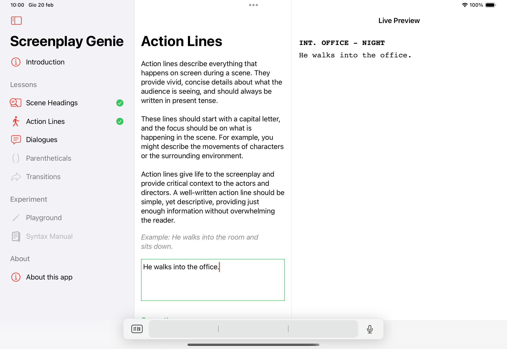
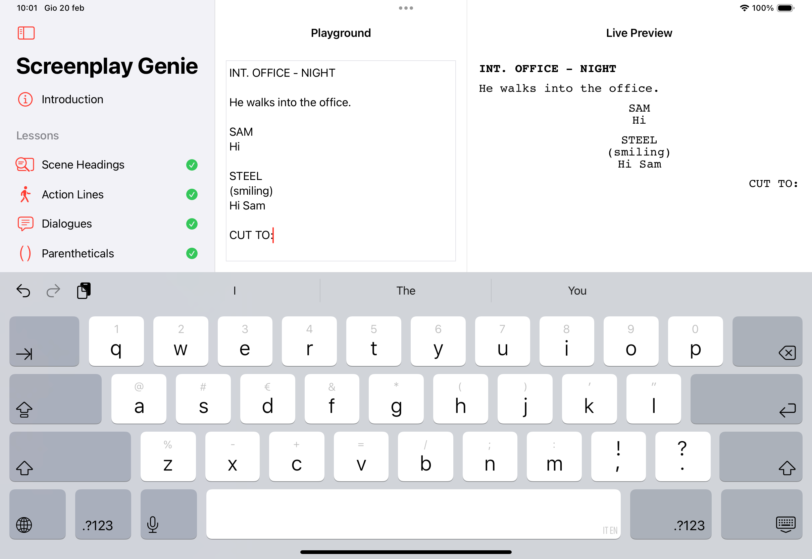
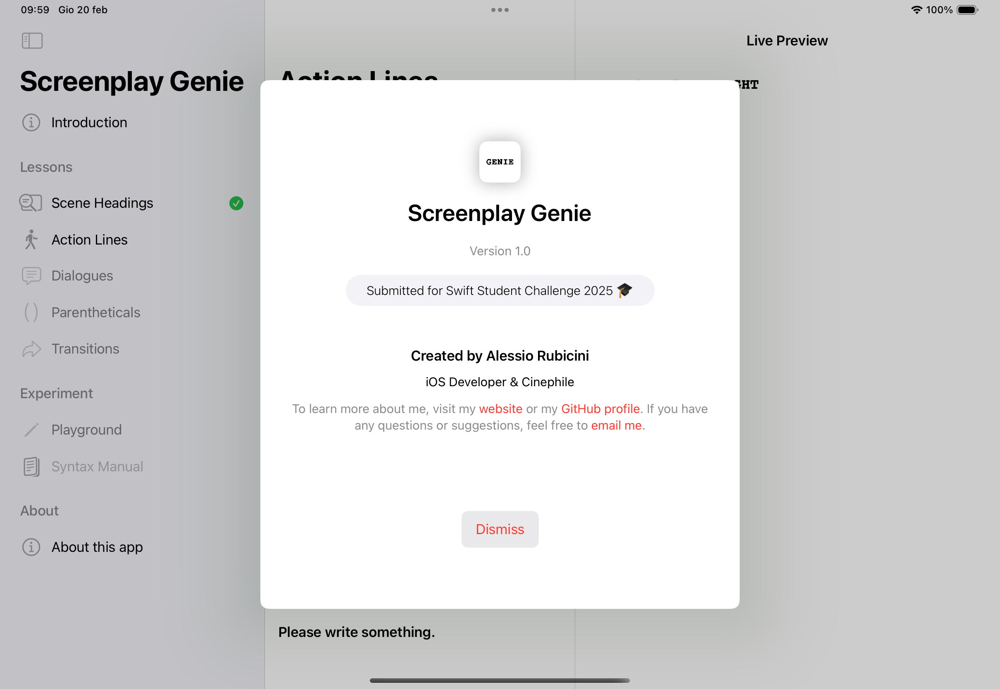

# Screenplay Genie
## A Swift Student Challenge Winner 2025 🎉

Screenplay Genie is an educational iOS app designed to guide users through the fundamentals of screenwriting in an interactive and engaging way. Whether you’re a beginner or looking to refine your skills, this app provides structured lessons, real-time previews, and a free writing playground to bring your stories to life.

### 📜 Features
- 📖 Interactive Lessons – Learn screenplay formatting and structure step by step.
- 👀 Live Preview – See your script transform into a properly formatted screenplay in real-time.
- 🎨 Free Playground – Apply what you’ve learned in an unrestricted writing environment.
- 📂 Fountain Markdown Support – Use the industry-standard lightweight markup language for screenwriting.

### Images

|  |  |
--- | ---

|  |  |
--- | ---

### Demo Video

